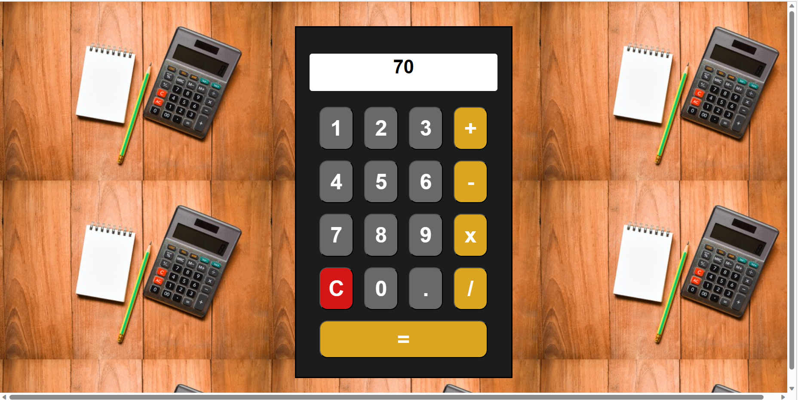

View and play with the calculator here: 

If you would like to clone this project and run it on your own local machine, follow the steps:

Copy the repo URL

In your terminal, run git clone <URL>

cd React-Calculator

npm start or yarn start (this will host the application on localhost:3000)
